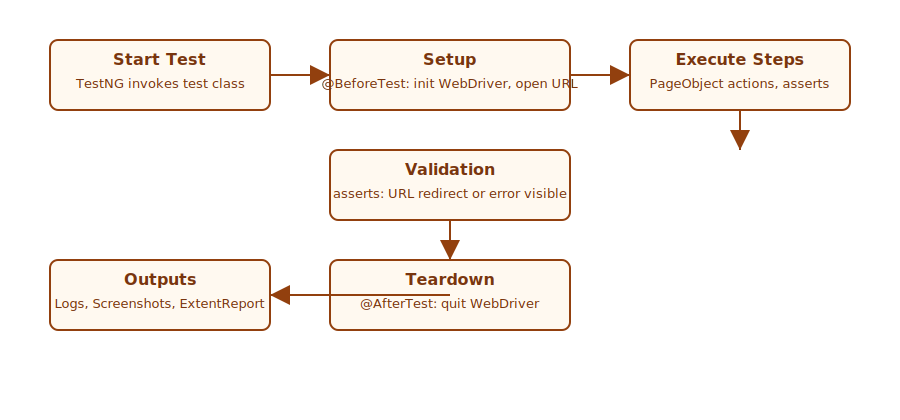

# Salesforce Login Automation

- **Project:** Enterprise-grade Selenium + Java + Maven + TestNG automation for Salesforce login page validation.
- **Location:** Repository root contains the Maven project and tests.

**Prerequisites:**
- Java 11 installed
- Maven installed
- Chrome browser installed (Chromium-based browsers supported)

**Project Structure**
- **pom.xml**: Maven build and dependencies
- **testng.xml**: TestNG suite configuration
- **src/main/java/pages/LoginPage.java**: Page Object (PageFactory, xpath locators)
- **src/test/java/tests/ValidLoginTest.java**: Valid login TestNG test
- **src/test/java/tests/InvalidLoginTest.java**: Invalid login TestNG test

**Run tests**
Run the suite (provide real credentials for valid-login test):

```bash
cd "$(pwd)"
mvn -Dsf.username=YOUR_USERNAME -Dsf.password=YOUR_PASSWORD test
```

Notes:
- If `sf.username`/`sf.password` are not provided, the valid-login test will be skipped and invalid-login will run with default placeholder credentials.
- WebDriver binaries are managed via WebDriverManager; no manual chromedriver installation required in most environments.

**Reporting**
- ExtentReports integration is not yet implemented in the codebase. To add ExtentReports:
  - Add the ExtentReports dependency to `pom.xml` and create a ReportManager utility that initializes `ExtentReports` and `ExtentHtmlReporter`.
  - Add a TestNG listener to capture test start, success, failure, and attach screenshots on failure.
  - Configure the listener in `testng.xml` or annotate tests/classes with the listener.

**Diagrams**
- Framework architecture and test flow diagrams are included in `docs/diagrams`.




**CI / Recommended usage**
- Run tests in CI with credentials provided as secure environment variables and passed via `-Dsf.username` and `-Dsf.password`.

**Support**
- Login page under test: https://login.salesforce.com/?locale=in
